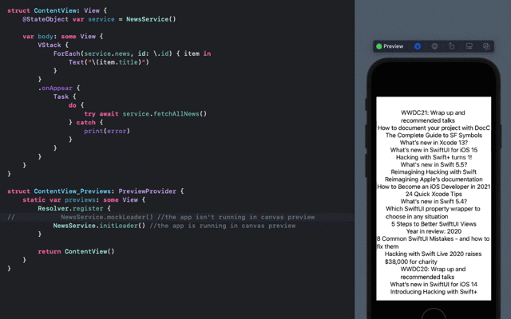

#  TestableApp

I combined [the idea to use functional programming](https://www.swiftbysundell.com/articles/dependency-injection-and-unit-testing-using-async-await/#adding-a-bit-of-functional-programming) instead of an loader instance in ModelView(I prefer to think of it as a service) and [Resolver](https://github.com/hmlongco/Resolver.git).



## Functional signatures for loads or actions 
```swift
typealias AsyncAction<T> = (T) async throws -> Void
typealias Loading<T> = () async throws -> T
```

## How to use it in the app
```swift
@main
struct TestableApp: App {
    init() {
        Resolver.register {
            NewsService.initLoader()
        }
    }
    
    var body: some Scene {
        WindowGroup {
            ContentView()
        }
    }
}
```

## How to use it in a view for running
```swift
struct ContentView_Previews: PreviewProvider {
    static var previews: some View {
        Resolver.register {
            NewsService.mockLoader() //the app isn't running in canvas preview
//            NewsService.initLoader() //the app is running in canvas preview
        }
        
        return ContentView()
    }
}
```

## How to use it in tests 
```swift
class TestableAppTests: XCTestCase {
    private var service: NewsService!
    
    override func setUpWithError() throws {
        // Put setup code here. This method is called before the invocation of each test method in the class.
        Resolver.register {
            NewsService.mockLoader()
            
        }
        service = NewsService()
    }

    func testLoadingNews() async throws {
        XCTAssertEqual(service.news.count, 0)
        try await service.fetchAllNews()
        XCTAssertGreaterThan(service.news.count, 0)
    }
}
```

